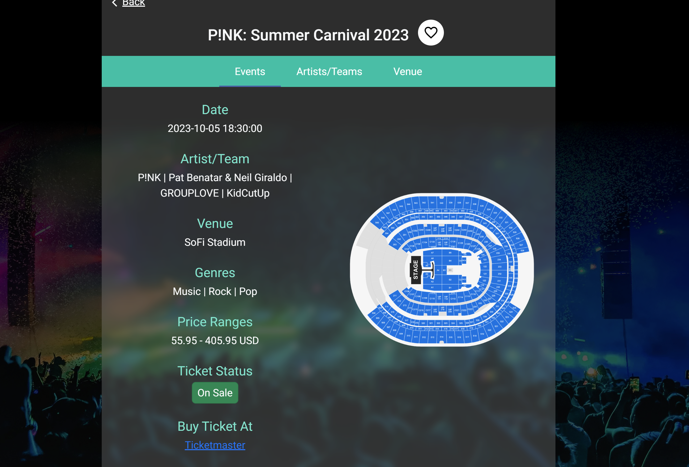
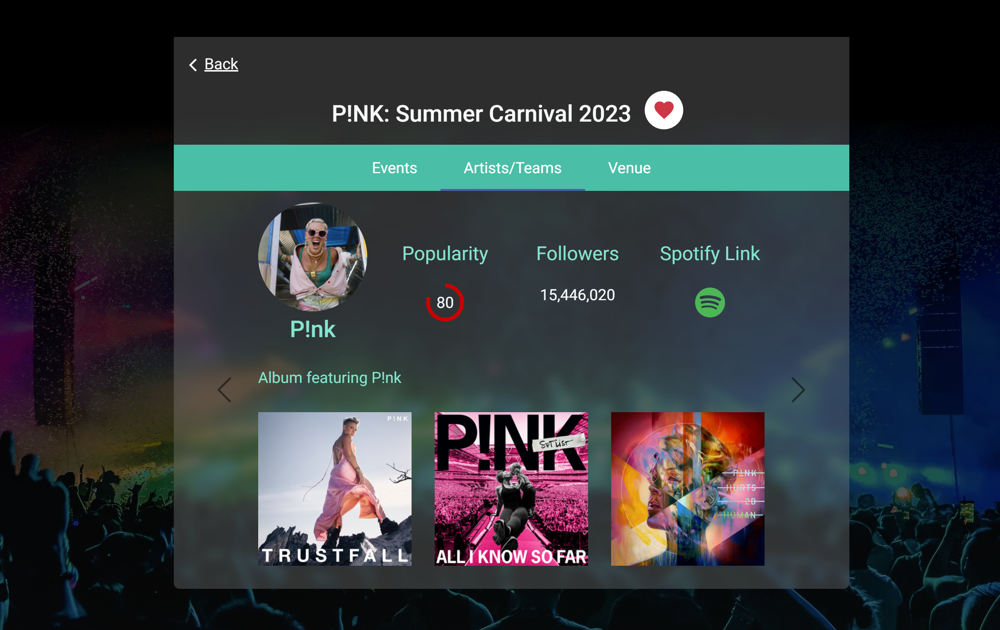
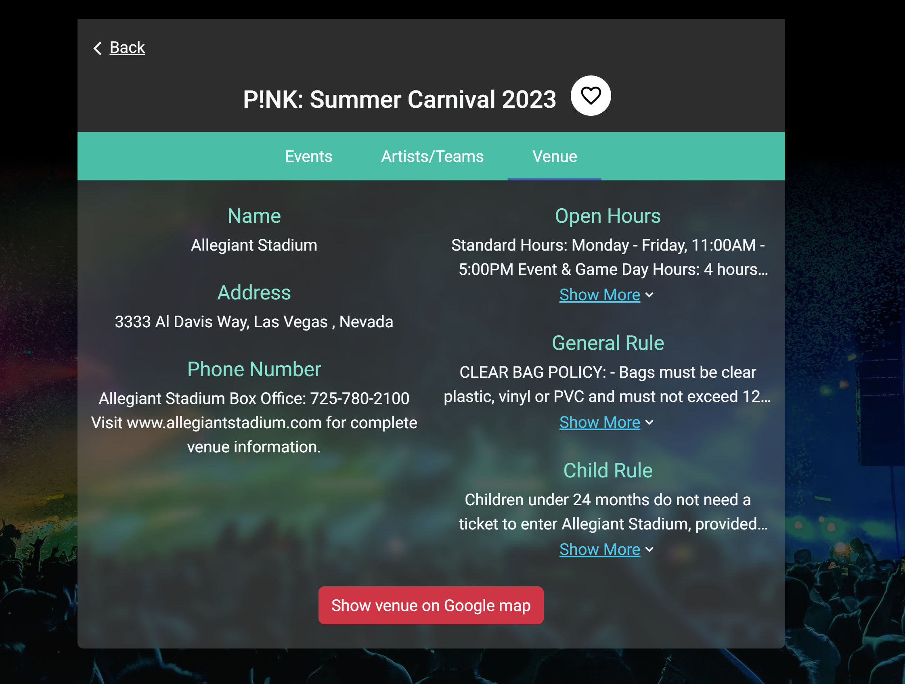

# Event Finder using Ajax, JSON, Angular, Bootstrap, RWD, Node.js, and Ticketmaster API

This website is an event-finder website using integrations with Ticketmaster APIs, Spotify APIs, Google Maps APIs, Google Geocoding APIs, Ipinfo APIs, Facebook APIs and Twitter APIs.

It is hosted on AWS Cloud Platform, and uses JavaScript/Node.js on the server side with Express Framework. The front-end uses Angular, TypeScript, and Bootstrap and is fully responsive. 

Link can be found here: (http://hw8-env.eba-hwjhcppp.us-east-1.elasticbeanstalk.com/search)

The site functionality consists of a search page with 5 different parameters, including geo-location based on user's IP address; an event details page; an Artists/Teams page; a Venue page; and the ability to add, remove, and view Favorite events.

For code samples, please contact morgan.gautho@gmail.com. 

For alternative version of the site hosted on GCP, please [click here](https://github.com/morgangauth/Projects/tree/main/Event%20Finder/Sites/GCP).

Images can be found below:

