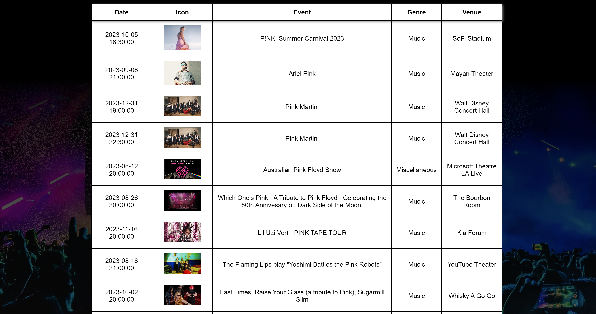
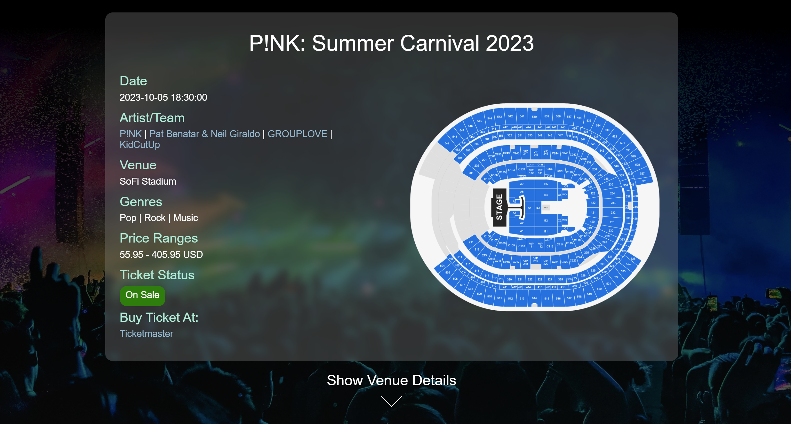
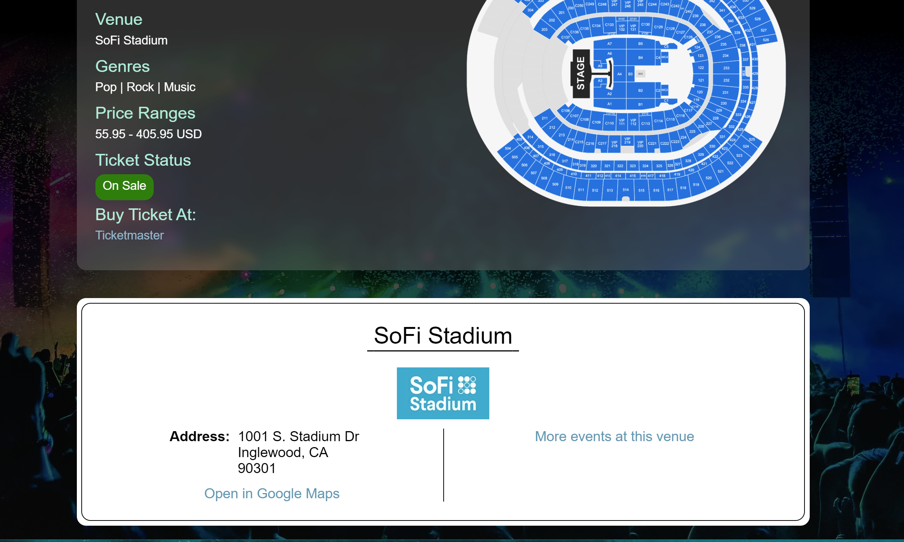

# Event Finder using Python, Flask, JSON, AJAX, and Ticketmaster API

This website is an event-finder website using integrations with Ticketmaster APIs, Google Geocoding APIs, and Ipinfo APIs.

It is hosted on GCP Cloud Platform, and uses Python/Flask on the server side. The front-end uses HTML, CSS, JavaScript, DOM, and JSON formatting. 

Link can be found here: (https://mg-hw6.wn.r.appspot.com/)

The site functionality consists of a search page with 5 different parameters, including geo-location based on user's IP address; an event details page, and a Venue details page.

For code samples, please contact morgan.gautho@gmail.com. 

For alternative version of the site hosted on GCP, please [click here](https://github.com/morgangauth/Projects/tree/main/Event%20Finder/Sites/AWS).

Images can be found below:

